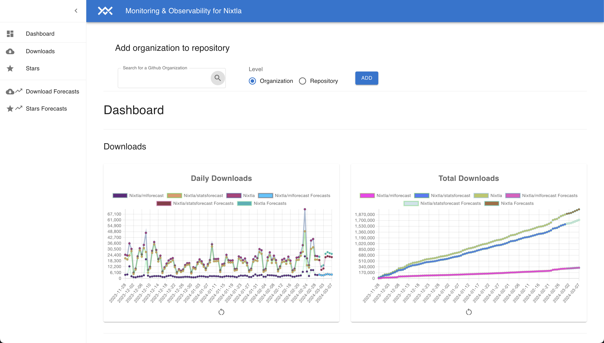
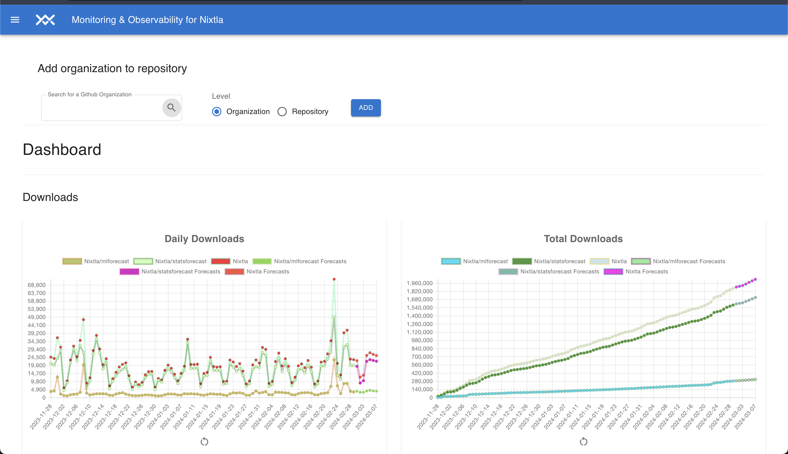
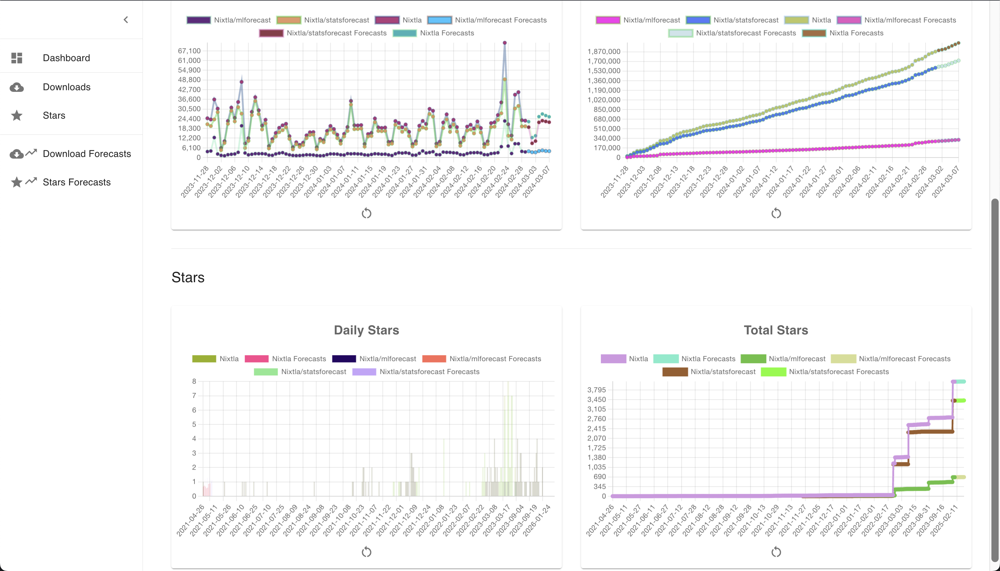
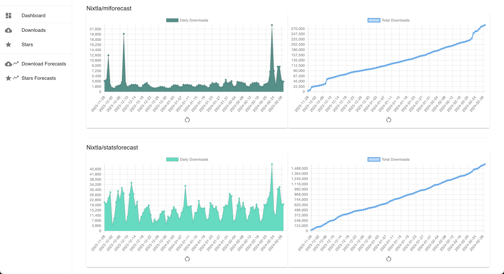
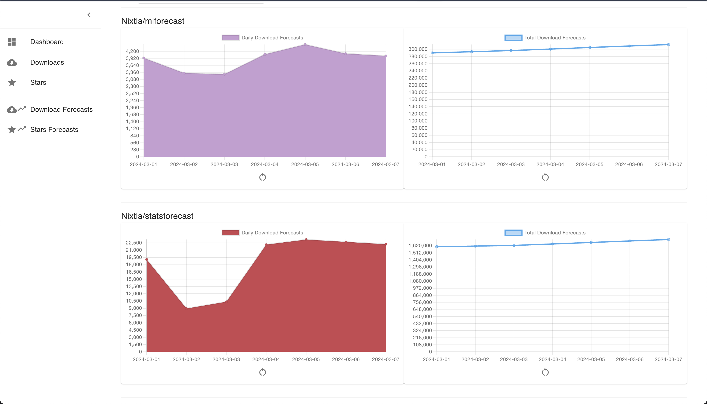
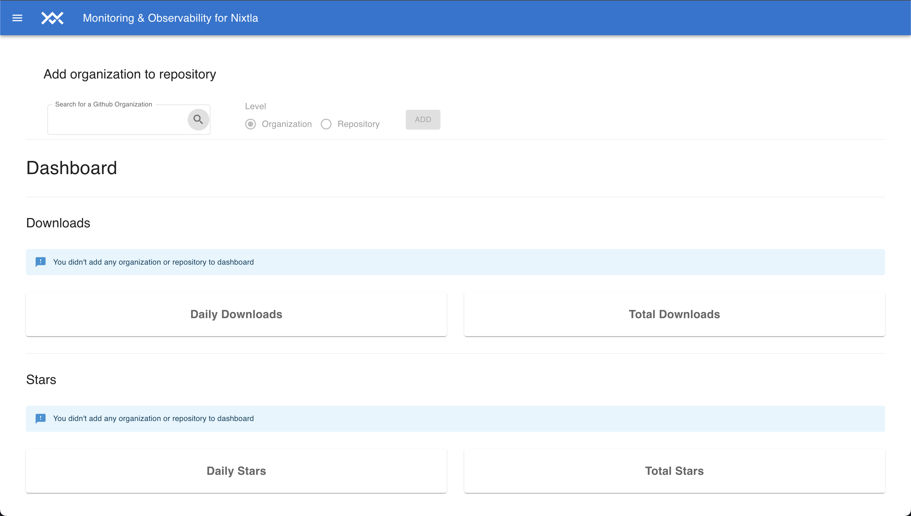
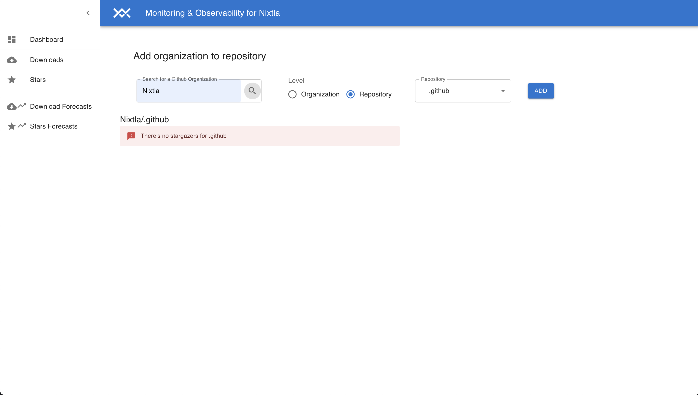
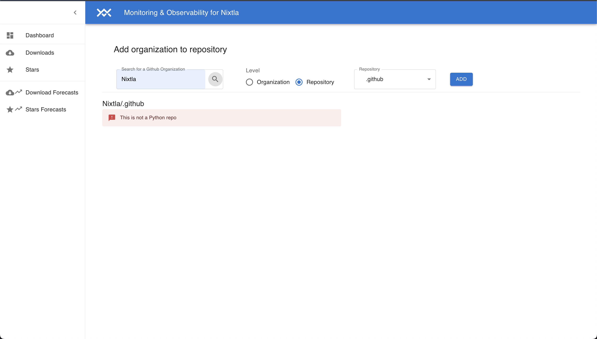
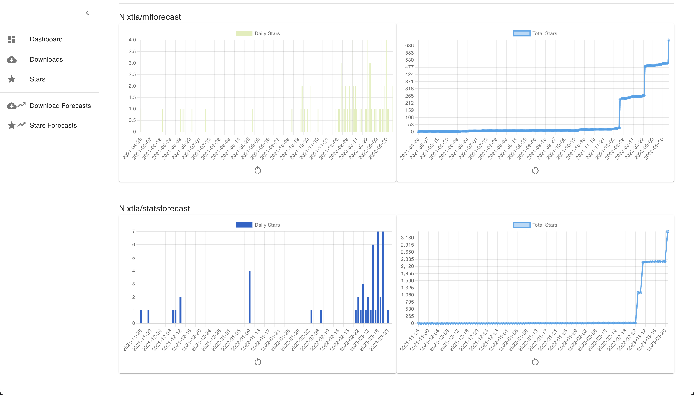
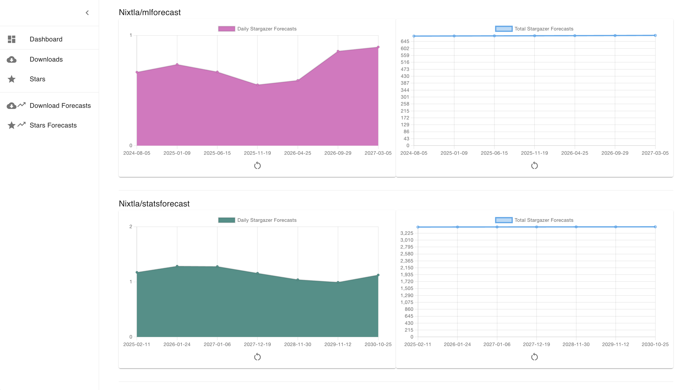

    <h1>
        Project Monitoring & Observability Webapp
    </h1>
    <h3>
        Monitor github projects and python downloads
    </h3>

---

**Github Monitor & Observability App** offers a way for tracking github repositories and organizations also. Provides
statistics related to Github stars, amount of downloads for Python projects (could be extended for other kind of projects
i near future), and forecasts for stars and downloads

### Roadmap features

- [x] Add component for searching an organization Github name
- [x] Add Navigation Bar that be hidden when you scroll, to have full screen view
- [x] Add Nixtla Logo to Navigation Bar, tooltip and redirection to Nixtla.com
- [x] Add Navigation idebar, for allowing navigation in the app
- [x] Add Navigation Bar Menu button, for allowing hiding the Navigation Sidebar
- [x] Make Navigation Bar responsive
- [x] Add favicon
- [x] Add Vertical Bar Chart
- [x] Add Line Chart
- [x] Add Area Chart
- [x] Add charts for displaying Stars from github at repo level on Star Section
- [x] Add charts for displaying downloads from python packages at repo level on Download Section
- [x] Add charts for displaying Stargazer Forecasts from github at repo level on Star Section
- [x] Add charts for displaying Download Forecasts from python packages at repo level on Star Section
- [x] Make all chart's layouts responsive, change layout to columns when the layout page is too small
- [x] Add zoom options to all the charts
- [x] Add pan options to all the charts
- [x] Add reset zoom and pan options to all the charts
- [x] Add charts for displaying Stars from github at repo level on Dashboard section
- [x] Add charts for displaying downloads from python packages at repo level on Dashboard Section
- [x] Add charts for displaying Download Forecasts from python packages for Dashboard Section
- [x] Add charts for displaying Stargazer Forecasts from pip python packages for Dashboard Section
- [x] Allow to compare between different datasets in same chart on Dashboard Section
- [x] Allow show/hide charts datasets
- [x] Add *Fixtures* to be able to develop without affecting to External API's rate limits 
- [x] Add level option, to be able to choose between repositories or organizations levels in all sections
- [x] Mix all functionalities on dashboard unifying info on same chart
- [x] Add tracking logs
- [x] Add info message in case that selected repository or organization is not found
- [x] Add error message in downloads section in case that is not a python project
- [x] Add warning message if any repository or organization was not added yet
- [x] Allow to configure the number of polling times, to be able to have more granularity
- [x] Parallelize processes for fetching pages on specific repos, to be able to increase the performance. Before the calls were taking more than 23 secs, and after we got them in 13 secs
- [x] Parallelize processes for fetching all repos pages at same time. Before this improvement, the calls were get in 13 secs and after in 5secs
- [x] Parallelize processes for downloads. Before we got the calls in 25 secs, and after in 4 secs. All these changes related to improvements made that we could increase polling times without affecting the time

### Future features

- [ ] Add extra charts, for example for getting which projects are the most important
- [ ] Add extra charts, for example for getting which projects are trendy
- [ ] Add mongodb for avoiding requests
- [ ] Allow to configure the number of days for the forecasts
- [ ] Allow to configure user's data and API own keys for Pepy and Github, to be able to increase rate limits
- [ ] Allow to configure user's data, to be able to save dashboards
- [ ] Add option to be able to save chart images and download it
- [ ] Support downloads from npm packages and get statistics
- [ ] Identify if it's an npm package automatically, as is made with python packages

## More features details

### There's a lot of extra tech details. For more details, please read about:
* [Github Monitor App README](app/README.md)
* [Github Monitor Backend README](server/README.md)

## Github Monitor & Observability

*[https://github-monitor-app.onrender.com/](https://github-monitor-app.onrender.com/)*

## Captures

* Downloads on Dashbord Section:

* Hiding Navition Sidebar:

* Stars on Dashbord Section:

* Downloads Section:

* Download Forecasts Section:

* Info Messages:

* No Stars Info Message:

* Not Python Error Message:

* Stars Section:

* Star Forecasts Section:

## Contributors ✨

Thanks goes to these wonderful people:

<table>
  <tbody>
    <tr>
      <td align="center" valign="top" width="14.28%"><a href="https://github.com/sgonzaloc"> <b>Gonzalo</b></a></td>
    </tr>
  </tbody>
</table>
